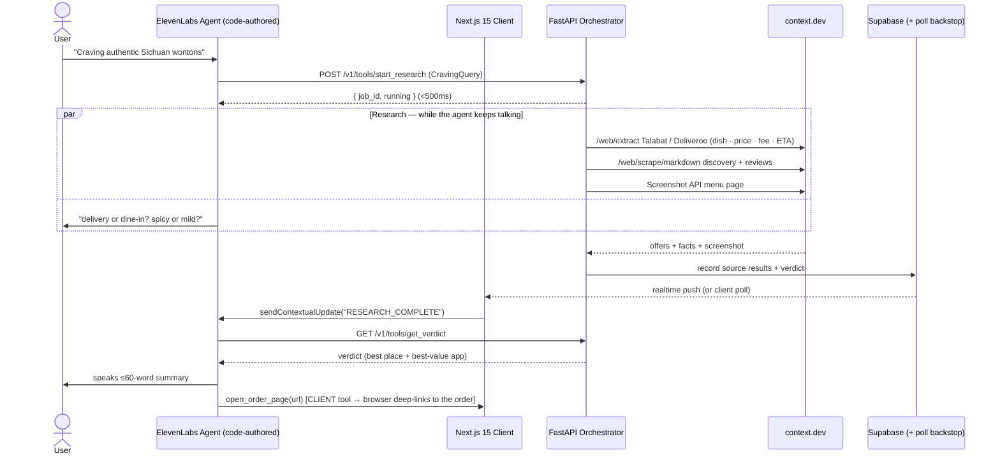

# System Architecture — Dalal (دلال)

> **Product direction: the food broker** ([FOOD-FLOW.md](FOOD-FLOW.md)). This describes the engine — proven first on the shopping domain (live Noon/Amazon via context.dev) and now repointed to food. The engine is domain-blind; food swaps the sources and adds the deep-link hand-off. **The agent is built as code (Devin), not the no-code workflow builder** (§ Agent-as-code).

## 1. Sequence (food)



## 2. Modules & boundaries (monorepo)

```
apps/api (FastAPI)
├─ app/adapters/            # SourceAdapter protocol + context.dev client (PROVEN LIVE)
│    context_client.py      # /web/scrape/markdown · /web/extract · (screenshot/brand → add)
│    sources/               # food: delivery_app.py · discovery.py · reviews.py   (shopping: marketplace.py …)
│    registry.py            # DomainConfig: sources + pinned demo URLs (the domain seam)
├─ app/services/            # orchestrator.py (asyncio.gather, 20s timeout) · synthesizer.py (grounded)
├─ app/api/routes/tools.py  # start_research · research_status · get_verdict  (ElevenLabs webhook tools)
├─ app/domain/models.py     # typed contracts (CONTRACTS.md)
└─ agent/                   # dalal-agent.json + apply script → ElevenLabs API (Agent-as-code, §5)

apps/web (Next.js 15)
├─ app/page.tsx             # voice orb · research trail · verdict cards · transcript rail
├─ hooks/useDalalAgent.ts   # ElevenLabs session + CLIENT TOOLS (open_order_page = the deep-link)
├─ hooks/useResearchStream  # Supabase realtime + poll backstop
└─ app/api/token/route.ts   # mints the ElevenLabs signed URL
```

The orchestrator is **domain-blind** — it loops `DomainConfig.sources`. Food is a new config + new adapters against the same protocol; no orchestrator change. All vendor keys server-side; the browser sees only the ElevenLabs agent id / signed URL and the Supabase anon key.

## 3. Live-data integrity (non-negotiable)

- **Real fetch or labelled fixture — never silent constants.** Adapters call context.dev; with no live key they return `is_fixture=true` and the UI badges "sample data."
- **Pre-warm the demo URLs** (context.dev `maxAgeMs` ~1 day default) so on-stage fetches are warm (~1–2 s) and still real. Verified: warm extract ≈ 3.5 s; a browser UA is required to clear Cloudflare (error 1010).

## 4. Completion signalling (keep BOTH)

Primary **Supabase realtime** push (`useResearchStream`) → UI fires `sendContextualUpdate`. Backstop **poll** `get_verdict` (already in `page.tsx`) so the demo completes even without Supabase configured. `get_verdict` must return `{status:"running"}` (not 404) — see §6 gap #3.

## 5. Agent-as-code (Devin builds this — not the workflow builder)

The ElevenLabs agent is a **versioned code artifact**, not a hand-clicked dashboard config:
- `apps/api/agent/dalal-agent.json` — system prompt (broker persona + the interview + the **delivery/dine-in branch, expressed in the prompt**), server tools (`start_research`/`get_verdict`), the `open_order_page` **client tool**, and (stretch) a knowledge-base reference for authenticity.
- An apply script creates/updates the agent via the **ElevenLabs API** (`create_agent`/`update_agent`) so it's reproducible and reviewable in the PR.
- Branch logic and any orchestration live in **prompt + backend code**, keeping it Devin-authored and legible for codebase-health judging.
- **Devin parcels** (one PR per slice, fixtures at every boundary): the food source adapters, the synthesizer, the schemas, the agent config + apply script, and the client-tool wiring. Logged in [AGENTIC_ENGINEERING.md](AGENTIC_ENGINEERING.md).

## 6. Current code state → remaining work (build on top; don't rebuild)

The shopping engine is the proven base. Status of the four wiring gaps:
1. ✅ **context.dev is live** — client fixed to the real endpoints (+ browser UA), `marketplace.py` pulls real structured offers (verified). *Food:* repoint to delivery-app adapters using the same proven path.
2. ⬜ **Synthesizer still hardcoded** — grounds nothing yet; wire it to the fetched offers (CONTRACTS.md grounding rules).
3. ⬜ **Voice not wired to research** — the agent's `start_research` must set the active `job_id`; add the `open_order_page` **client tool** for the hand-off (currently button-driven).
4. ⬜ **`get_verdict` 404s when not ready** — return HTTP 200 `{status:"running"}`.

## 7. Security posture (proportional)

Vendor keys server-side. `/v1/tools/*` validate `X-Dalal-Key` (set a real `DALAL_SECRET_KEY` for the deployed demo — the default no-ops). Scraped content + LLM output are untrusted: schema-validate at boundaries; treat scraped text as data, not instructions. The deep-link `open_order_page` only navigates to allow-listed retail/delivery domains (no arbitrary URLs). No PII, no persistence.
