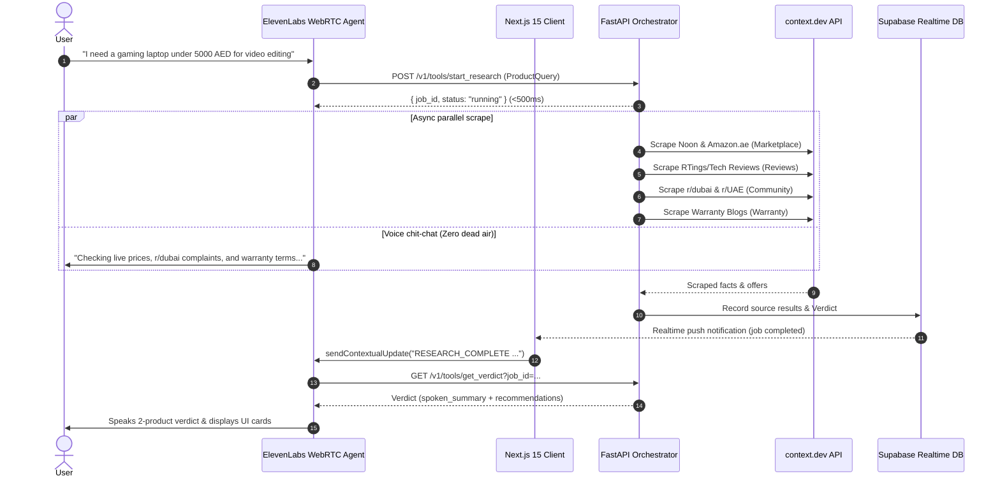

# System Architecture — Dalal (دلال)

## High-Level Sequence Diagram

## Key Architectural Decisions

1. **Decoupled Asynchronous Execution**:
   - Webhook tools in ElevenLabs must respond in <500ms to prevent agent timeouts or hallucination.
   - `start_research` launches background `asyncio.gather()` jobs and immediately returns `{ job_id, status: "running" }`.

2. **Realtime Push Channel**:
   - Supabase Realtime streams adapter progress rows into Next.js.
   - When 4 sources finish (or max timeout is reached), Next.js fires `sendContextualUpdate("RESEARCH_COMPLETE")` on the WebRTC session.

3. **Resilient Partial Degradation**:
   - Every source adapter operates with a strict 20-second timeout.
   - If an adapter fails or times out, `orchestrator.py` synthesizes whatever facts were gathered and assigns a `medium` or `low` confidence score instead of crashing.
