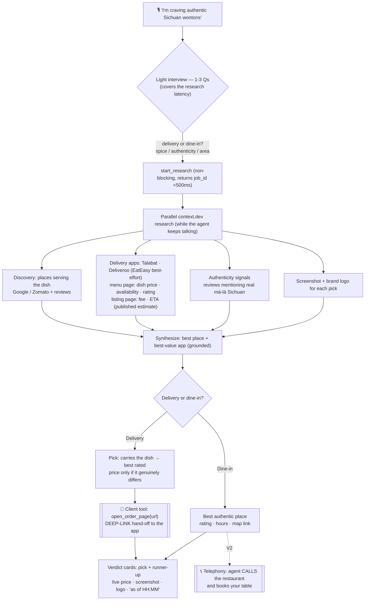

# Dalal — Food Flow Map (the pivot)

> **Supersedes the shopping framing.** Dalal pivots from "where to buy a product" to a **voice food broker**: speak a craving → it finds the best place, compares the dish live across delivery apps, and **takes you to the order**. The engine is unchanged (see §4 "What carries over"); we repoint the sources and add one new capability — the action hand-off. PRD.md / ARCHITECTURE.md / CONTRACTS.md still describe the shopping build and need repointing (tracked in §7).

## 1. Why this, not ChatGPT

Research-and-recommend is commoditized — ChatGPT with browsing will name the best Sichuan wontons in Dubai. **The moat is action:** ChatGPT is an advisor and structurally stops at advice; it cannot complete or hand off a transaction on a UAE delivery app. Dalal does the **last mile** — craving → *ready to order*. The demo's climax is the hand-off, not the recommendation.

## 2. The flow

The signature mechanic is unchanged from the shopping build: **the interview question is asked *over* the research** — no spinner, the latency is the conversation.

## 3. Capability slotting (which sponsor feature, where, and what tier)

| Capability | Tool · feature | Where in the flow | Tier |
|---|---|---|---|
| Voice agent, barge-in, interview | **ElevenLabs** Agents | intake + branch | Core *(carryover)* |
| Non-blocking research + poll/realtime completion | engine | `start_research` → `get_verdict` | Core *(carryover)* |
| Live restaurant discovery from the spoken craving | **context.dev** `POST /web/search` | D → D2 | Core *(proven live 2026-08-08)* |
| Structured dish extract (dish · price · sold-out · rating · review count) — **menu page** | **context.dev** `/web/extract`, `maxPages:1` | D2 | Core *(proven live)* |
| Delivery fee · ETA · min order · offer text — **area listing page** (separate fetch, joined on restaurant name) | **context.dev** `/web/extract` | D2 | Core *(proven live)* |
| Rank: carries-the-dish → reviews → price only where it differs | synthesizer | E → G | Core |
| **Deep-link hand-off (the wow)** | **ElevenLabs client tool** `open_order_page(url)` | H | **Core** |
| Live screenshot of the menu on the card | **context.dev** `GET /web/screenshot` | D4 → K | Core *(proven live)* |
| Brand logo / colour on cards | **context.dev** `POST /brand/retrieve` | D4 → K | Stretch *(proven live)* |
| Authenticity smarts ("real má-là or mild?") | **ElevenLabs** Knowledge Base (RAG) | B | Stretch |
| Judges try it on their phones | **ElevenLabs** web widget + shareable link | distribution | Stretch |
| Agent built **as code** — config · prompt · tools · client handlers (delivery/dine-in branch lives in the prompt) | **Devin** + ElevenLabs API (`create_agent`/`update_agent`) | agent build | Core *(best use of Devin — not the no-code workflow builder)* |
| **Agent phones the restaurant to book a table** | **ElevenLabs** telephony (SIP/Twilio) | J | **V2** |

**Verified constraints we design around** (live capability run, 2026-08-08 — authority: [VENDOR-CONTRACTS.md §0](VENDOR-CONTRACTS.md)):

- **`POST /web/search` EXISTS.** This doc previously said context.dev has "no web-search endpoint" and told us to pin demo URLs — **refuted 2026-08-08; do not reinstate it.** Discovery is **fully live**: any spoken craving is resolved at runtime; no pinned restaurant URLs.
- **The data is split across two pages per app** (menu + area listing), joined on restaurant name. Fee/ETA are **not** on the menu page.
- **Talabat menu URLs need `?aid=<areaId>`** or they silently 302 to the homepage and return HTTP 200 with zero prices. The `aid` is an area id, is not transferable between restaurants, and comes from `/web/search`.
- **Usable apps: Talabat + Deliveroo** (rich); **EatEasy best-effort** (thin coverage). noon Food, Careem, Smiles, Keeta, InstaShop and Zomato yield **no dish prices** — Careem/Smiles/Keeta are app-only. Zomato is a *reviews* source.
- **Delivery apps give a rating NUMBER, never review TEXT.** Review bodies (the authenticity narrative) come only from Zomato / TripAdvisor.
- **The final per-user checkout fee/ETA is unobtainable** (computed behind auth). The listing-page fee/ETA is the app's **published estimate** and must be labelled as such.
- **No browser automation** — a true in-app cart pre-fill is not context.dev's job; it's V2 via partner APIs.

## 4. What carries over from the shopping engine (~70% — this is why the pivot is cheap)

Everything structural transfers untouched; we only repoint sources and add the hand-off:

- **Voice agent** (ElevenLabs, WebRTC, single voice, barge-in) — same.
- **context.dev client** — already proven live (correct endpoints, browser-UA past Cloudflare, `maxPages:1`, pre-warm, credit telemetry). Just point it at new domains.
- **Async orchestration** (`asyncio.gather`, 20 s per-adapter timeout, partial degradation) — same.
- **Adapter protocol + registry + the domain seam** — this *is* the "make the domain a variable" seam we built. Food is a new `DomainConfig` with new source adapters; the orchestrator stays domain-blind.
- **Verdict pattern** (pick + runner-up, grounded, `spoken_summary` ≤ 60 words) — same shape, new content.
- **Non-blocking `start_research` + poll `get_verdict` + Supabase realtime** — same.
- **Pre-warm + labelled fixture fallback** (`is_fixture`) — same discipline.
- **The UI shell** (voice orb, research trail, verdict cards, transcript rail) — same; re-skin copy.

## 5. What's new (~30%)

- **Food source adapters** (same `SourceAdapter` base): `DeliveryAppAdapter` (Talabat/Deliveroo required + EatEasy best-effort — searches, then joins the **menu** page for dish·price·rating with the **area listing** page for fee·ETA·min·offer) and `RestaurantReviewsAdapter` (Zomato/TripAdvisor review *text* = the authenticity signal). Discovery is no longer a separate adapter — `/web/search` runs inside the delivery adapter. Careem/Smiles/Keeta are app-only and carry no scrapable menu (§3).
- **The delivery-vs-dine-in branch** (workflow builder or prompt).
- **The deep-link hand-off** — ElevenLabs **client tool** `open_order_page(url)` registered in `useDalalAgent`, so the *voice agent itself* navigates the browser to the winning app's restaurant page.
- **context.dev Screenshot + Brand Intelligence** → card assets (proof + polish).
- **Authenticity knowledge base** (ElevenLabs RAG) for the interview.
- **New verdict shape:** restaurant, dish, app, delivery_fee, eta, deep_link, screenshot_url, logo_url (vs product/store).
- **Location context** — delivery apps are location-gated; set a fixed Dubai location for the demo.

## 6. 6-hour scope (core only)

Craving → light interview → research (**live `/web/search` discovery**, then menu ⋈ listing extract per app, plus review text) → ranked pick (carries the dish → rating → price only if it genuinely differs) → **client-tool deep-link hand-off** → verdict cards with a **live screenshot**. **Do not pin URLs** — discovery is live (locked decision, 2026-08-08); pre-warm the likely demo cravings instead so the on-stage fetch is a warm-cache hit, and keep the labelled fixture fallback. Everything else in §3 is stretch.

## 7. What V2 looks like

- **📞 The agent phones the restaurant and books your table.** The dine-in equivalent of the delivery deep-link, via ElevenLabs telephony (SIP/Twilio outbound). *"I'll ring them and reserve a table for two at 8."* A real action ChatGPT structurally cannot do — the standout V2 wedge, pulled out of the hackathon scope for risk/time.
- **One-tap in-app checkout** — full cart pre-fill via delivery-app **partner APIs** (not public today), turning the deep-link hand-off into a completed order without leaving Dalal.
- **Multi-voice food council** — a "deal-hunter" and a "local foodie" debate the pick out loud (the original Live Council idea) for indecisive cravings.
- **Taste memory / reorder** — remembers spice tolerance and favourites: *"the usual biryani?"* Requires persistence (out of hackathon scope by design).
- **Arabic (and multilingual) voice** — ElevenLabs ships 31 languages; Dubai is multilingual. Arabic *speech*, not just Arabic *sources*.
- **Group ordering** — several people speak cravings; Dalal finds the one place that satisfies all.
- **Proactive / scheduled** — *"order my Thursday biryani at 1 pm."*
- **Promo & loyalty aggregation** — surface the best code/deal across apps; a seller-trust/deal-quality score that compounds into a real data asset.
- **WhatsApp as the entry point** — the dominant UAE channel.
